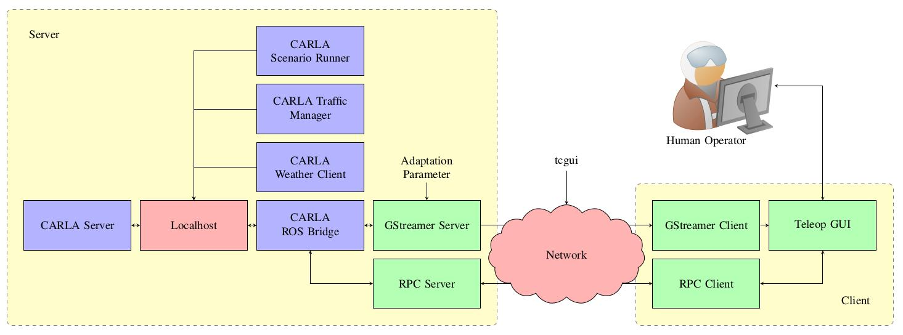

# TELECARLA

[](https://github.com/hofbi/telecarla)
[](https://github.com/psf/black)

TELECARLA is an extension of the CARLA simulator for teleoperated driving. We use GStreamer for compression and transmission of the camera data. The interface between our framework and CARLA is via ROS.



## Paper

If you use TELECARLA please cite our paper.

*TELECARLA: An Open Source Extension of the CARLA Simulator for Teleoperated Driving Research Using Off-the-Shelf Components, Markus Hofbauer, Christopher B. Kuhn, Goran Petrovic, Eckehard Steinbach; IV 2020* [[PDF](https://www.researchgate.net/publication/341293636_TELECARLA_An_Open_Source_Extension_of_the_CARLA_Simulator_for_Teleoperated_Driving_Research_Using_Off-the-Shelf_Components)]

```
@inproceedings{hofbauer_2020,
    title = {TELECARLA: An Open Source Extension of the CARLA Simulator for Teleoperated Driving Research Using Off-the-Shelf Components},
    booktitle = {31st IEEE Intelligent Vehicles Symposium 2020 (IV)},
    publisher = {IEEE},
    address = {Las Vegas, NV, USA},
    author = {Hofbauer, Markus and Kuhn, Christopher B. and Petrovic, Goran and Steinbach, Eckehard},
    month = {Oct},
    year = {2020},
    pages = {1--6},
}
```

## Setup

1. Download the carla simulator release from [GitHub](https://github.com/carla-simulator/carla/releases/latest)
1. Install ROS: http://wiki.ros.org/ROS/Installation
1. Create a workspace with `mkdir -p ~/catkin_ws_teleop/src`
1. Clone the code into the workspace `src` folder
1. Run the install script: `./install.sh`
1. Build the workspace: `catkin build`
1. Source your workspace `source ~/catkin_ws_teleop/devel/setup.<your_shell>`

## Run

See the main module for running the application: [telecarla](telecarla/README.md#Run)

## Code format

```shell
# Fomrat the code
make format

# Check format
make check_format

# Pylint
make pylint
```
